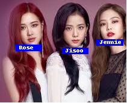
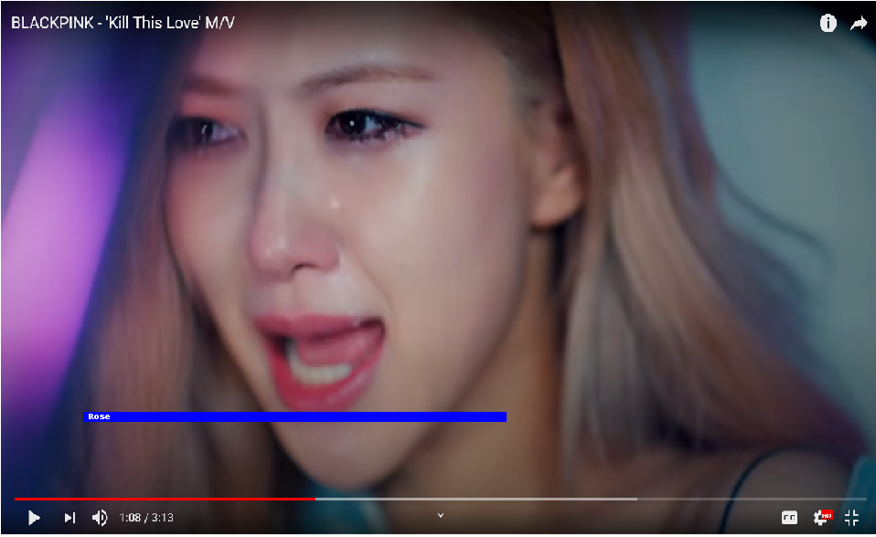
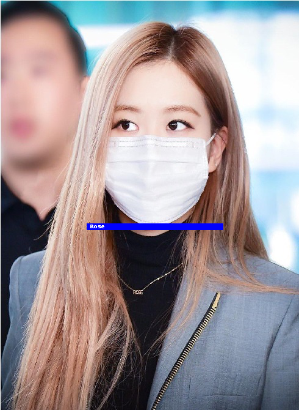
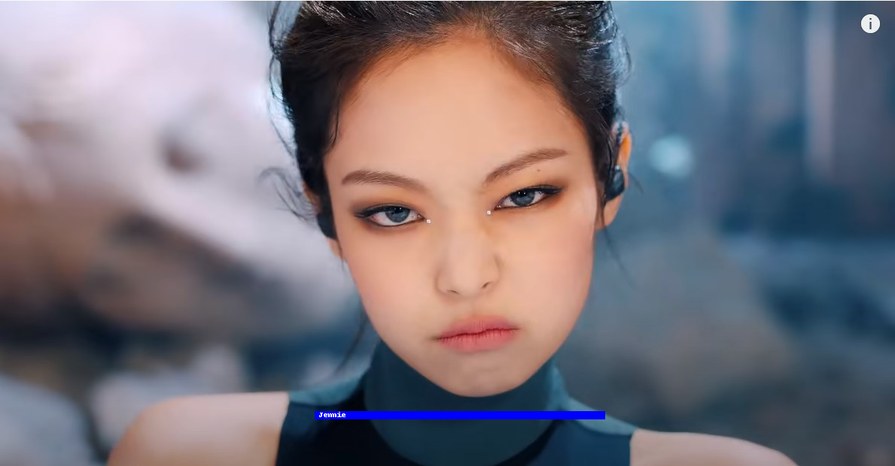

# Unsupervised Face Recognition using a Video clip
In this paper, I am proposing a faces classifier that takes videoclips as input and applies unsupervised learning to cluster the extracted faces from that video. These clusters
will be used to classify unknown images effectively. This
classifier is able to classify faces regardless of face angle,
facial expressions, facial wears (sunglasses, facemasks,
etc..), and different levels of makeup. Moreover, it builds a
labeled dataset that can be used to train other supervised
learning classifiers
## Results
### Multiple faces in one image

### Crying

### With mask

### Laughing

### With Eyeglasses

### Angry

